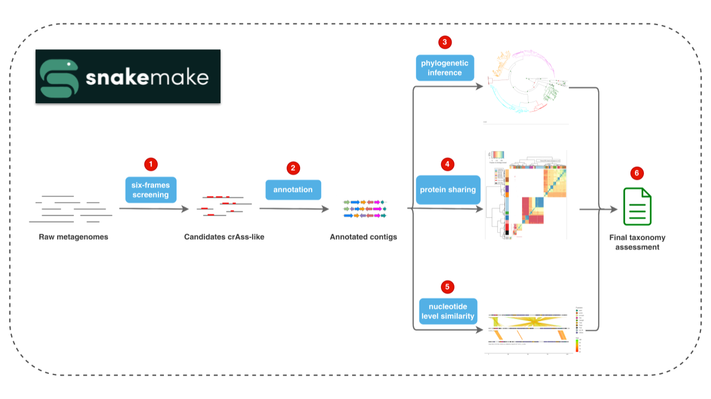

# Overview

CrassUS is a pipeline for identifying and classifying bacteriophages from the
_Crassvirales_ order. Taking as input a metagenome/metavirome, CrassUS is able to
identify which contigs are _Crassvirales_ and to classify them into the different
families, subfamilies, genera and species of the order.

Flowchart below describes the main steps in the pipeline, which is written in
Snakemake for efficiency and reproducibility:

1. Input contigs are translated into six-frames and scanned with HMM profiles
made of conserved, _Crassvirales_ genes sequences such as the large subunit of
the terminase (TerL), major capsid protein (MCP) or portal protein. Contigs
showing significant similarity to any of these profiles are considered as
candidates _Crassvirales_ and analyzed in further steps.

2. Open Reading Frames (ORFs) are predicted taking into account the opal (TGA)
and amber (TAG) stop codon reassignments to tryptophan and glutamine, respectively.
ORFs are then functionally characterized by comparing them to a database of
conserved _Crassvirales_ profiles.

3. Phylogenetic relationship with reference _Crassvirales_ is one of the
signals used at the classification step. By default, phylogenies for the TerL,
MCP and portal proteins are inferred and belonging of candidates to any reference
clade is assessed.

4. The second signal is based on the number of orthologs shared between the
candidates and the reference _Crassvirales_. Cutoffs based on the analysis of
solely reference genomes are used to delineate the taxons.

5. Last signal is based on the similarity at the nucleotide level between the
candidates and the reference.

6. All three signals are combined to annotate the candidates with the deepest
possible taxonomic annotation.     
