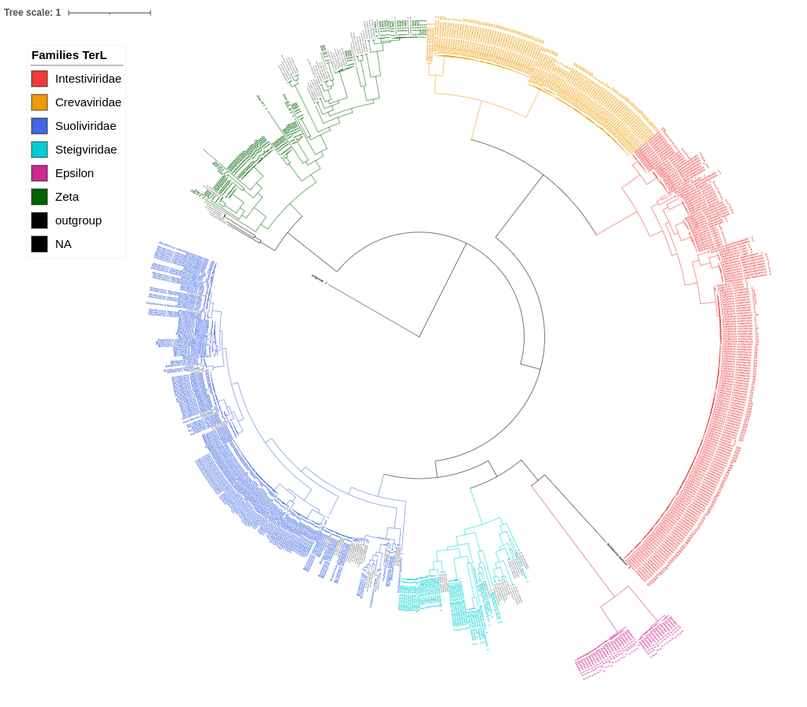
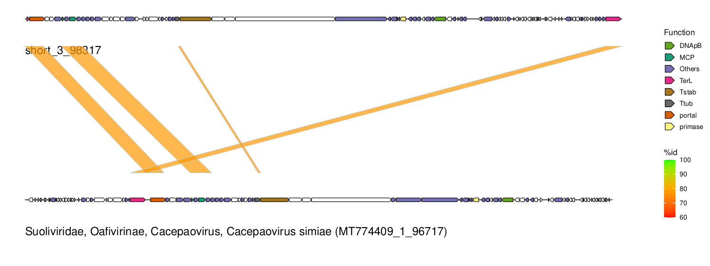

## Output

## Classification results
Final classification results can be found in `results/<analysis_id>/crassus_results.tsv`.
This is a tabular file with each row representing a contig identified as candidate
_Crassvirales_. Information below is provided for each of these contigs:

- **crassus_id**: unique CrassUS identifier
- **contig**: user contig identifier
- **sample**: sample of the contig
- **length**: length of the contig
- **len/taxa_len**: relation between contig length and the average genome length
of the deepest predicted _Crassvirales_ taxa.
- **ref_taxa**: deepest predicted _Crassvirales_ taxa for the contig
- **DTR**: Direct Terminal Repeats detected (`True` or `False`)
- **family**: Predicted _Crassvirales_ family, if any
- **subfamily**: Predicted _Crassvirales_ subfamily, if any
- **genus**: Predicted _Crassvirales_ genus, if any
- **species**: Predicted _Crassvirales_ species, if any
- **evidence_family**: Signals supporting the family assignment
- **evidence_genus**: Signals supporting the genus assignment
- **notes**: warnings about the assignments
- **discard**: `True` if there was not enough evidence to classify the contig at least at the family level.

## Phylogenies for iToL

After inferring the phylogenies of the three marker genes, CrassUS generates annotation files suitable for 
[iToL](https://itol.embl.de/). To visualize the phylogeny, first upload the `.nwk` file under 
`results/<analysis_id>/5_phylogenies/3_iToL`, and once the tree is loaded, navigate to the _Datasets > Upload annotation 
files_ section and upload the paired `.txt` file. You should be able to visualize the phylogeny with the reference 
sequences colored

## Genome diagrams

If specified under the _genomes_plot > generate_plots_ section of the config file, `results/<analysis_id>/7_ANI/alignment_plots.pdf` 
will be generated containing a figure for each candidate contig found by CrassUS. ORFs are depicted and colored 
according to their function. At the bottom the most similar reference genome is depicted as well as their alignment regions.
